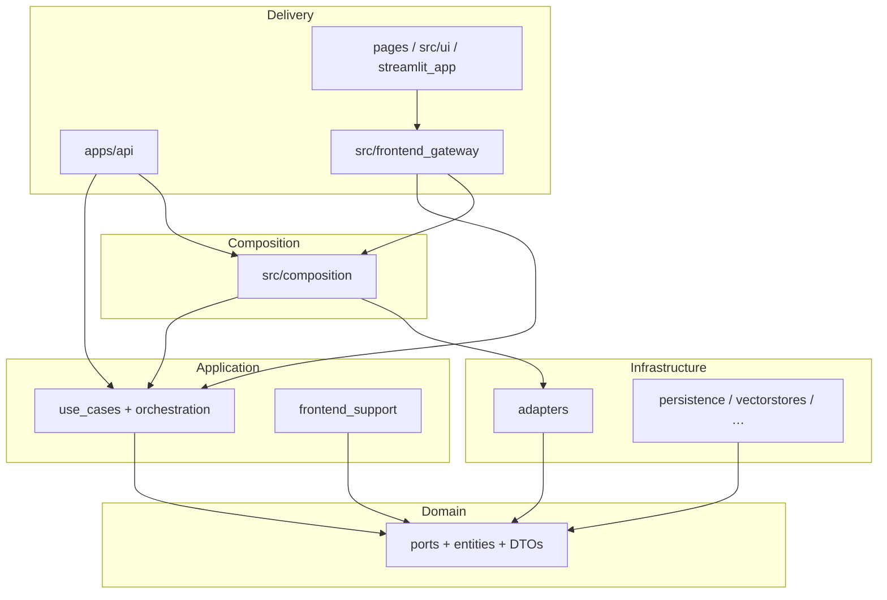

# Architecture (Clean Architecture)

RAGCraft follows a **ports-and-adapters** style: **domain** at the center, **application** orchestrates, **infrastructure** implements technical details, **composition** wires objects, **delivery** (FastAPI, Streamlit client) stays thin.

**Canonical flow details for RAG:** **`docs/rag_orchestration.md`**. **Import rules:** **`docs/dependency_rules.md`**. **End-state migration summary:** **`docs/migration_report_final.md`**.

## `src/domain/`

**Belongs here:** entities, value objects, pure domain logic, **ports** (`Protocol` / ABC), and shared types such as `PipelineBuildResult` (**`latency`** is **`PipelineLatency`**, not a stage ``dict``), **`RAGResponse`** (**`latency`** is **`PipelineLatency | None`**), **`PipelineLatency`**, **`GoldQaPipelineRowInput`**, `SummaryRecallDocument`, `RetrievalSettings`, **`BufferedDocumentUpload`** (multipart ingest payload: filename + bytes), **`ProposedQaDatasetRow`** (LLM QA proposals before persistence), **`RagInspectAnswerRun`**, **`QueryLogIngressPayload`**, **`EvaluationJudgeMetricsRow`**, **`merge_summary_documents_weighted_rrf`** (`summary_document_fusion.py`), and retrieval policy helpers under **`src/domain/retrieval/`** (e.g. **`summary_recall_execution_plan`**).

**Does not belong:** FastAPI, Streamlit, SQLite drivers, LangChain, calls into `src.application` or `src.infrastructure`. (Domain may use `src.core` for config paths and shared exceptions where already established.)

## `src/application/`

**Belongs here:**

- **Use cases** under `src/application/use_cases/` — one primary workflow per class (e.g. `AskQuestionUseCase`, `BuildRagPipelineUseCase`, `RunManualEvaluationUseCase`). Shared RAG orchestration **DTOs** live under **`src/application/rag/`** (imported by chat/eval paths; guarded by **`test_orchestration_package_import_boundaries`**).
- **RAG orchestration helpers** under `src/application/use_cases/chat/orchestration/` — e.g. **`summary_recall_workflow.py`** (**`ApplicationSummaryRecallStage`** implements **`SummaryRecallStagePort`**), **`summary_recall_ports.py`** (technical ports for rewrite / vector / lexical recall), **`recall_then_assemble_pipeline`**, **`summary_recall_from_request`**, **`assemble_pipeline_from_recall`**, **`post_recall_pipeline_steps`**, **`ApplicationPipelineAssembly`**, **`PipelineQueryLogEmitter`**, port definitions (**`ports.py`**, **`PostRecallStagePorts`**, **`PipelineBuildQueryLogEmitterPort`**).
- **Evaluation RAG helper** — `execute_rag_inspect_then_answer_for_evaluation` in **`use_cases/evaluation/rag_pipeline_orchestration.py`** (inspect + answer + latency for eval; no production query log).
- **`GoldQaBenchmarkAdapter`** — **`use_cases/evaluation/gold_qa_benchmark_adapter.py`**; implements **`GoldQaBenchmarkPort`** by delegating to **`BenchmarkExecutionUseCase`** (wired from composition, not from **`EvaluationService`** internals).
- **Pipeline use-case ports** — `use_cases/chat/pipeline_use_case_ports.py` (`InspectRagPipelinePort`, `GenerateAnswerFromPipelinePort`) so evaluation does not depend on concrete chat use case classes.
- **Policies** under `src/application/chat/policies/` — pure helpers (dedupe, wire shapes) used by orchestration; RRF merge lives in **domain** (`summary_document_fusion`).
- **DTOs / wire helpers** — `application/http/wire.py`, evaluation DTOs, settings DTOs; **`build_query_log_ingress_payload`** builds domain **`QueryLogIngressPayload`**. RAG orchestration DTOs under **`src/application/rag/dtos/`** (e.g. **`VectorLexicalRecallBundle`**, **`RagEvaluationPipelineInput`**) plus domain **`RetrievalSettingsOverrideSpec`** for typed retrieval overrides on chat/RAG ports.
- **`frontend_support/`** — HTTP-mode stubs for the gateway (`http_backend_stubs.py`, `memory_chat_transcript.py`) so `src/frontend_gateway` does not import infrastructure.

**Does not belong:** importing `src.infrastructure` (wiring uses composition). Use cases must not import `src.frontend_gateway`.

## `src/infrastructure/`

**Belongs here:**

- **`adapters/`** — concrete implementations: RAG stack (`docstore_service`, **`summary_recall_technical_adapters.py`** — thin **`QueryRewriteAdapter`**, **`SummaryVectorRecallAdapter`**, **`SummaryLexicalRecallAdapter`**), `post_recall_stage_adapters`, evaluation (**`EvaluationService`** consumes **`GoldQaBenchmarkPort`** only; no **`BenchmarkExecutionUseCase`** import), workspace, SQLite repositories, `chat_transcript/memory_chat_transcript.py`, query logging, vector store helpers, ingestion loaders, etc.
- **`persistence/`**, **`vectorstores/`**, **`caching/`**, **`logging/`** — technical subsystems.

**Rules:**

- **Summary-recall sequencing** is **application-owned** (**`ApplicationSummaryRecallStage`**); infrastructure provides single-purpose technical steps behind **`SummaryRecallTechnicalPorts`**.
- Post–summary-recall **sequencing** for assembly lives in **application** (`assemble_pipeline_from_recall` + `post_recall_pipeline_steps`); adapters behind **`PostRecallStagePorts`** perform single technical steps.
- **All** of `src/infrastructure/adapters/**/*.py` must **not** import `src.application` except the explicit allowlist in **`tests/architecture/test_adapter_application_imports.py`** (today: **`rag/retrieval_settings_service.py`** subclasses **`RetrievalSettingsTuner`**).
- **Query logging** is **not** implemented inside vectorstore/docstore/rerank modules; **`QueryLogService`** accepts dict or domain **`QueryLogIngressPayload`**.
- Non-adapter infrastructure must not depend on application (see layer tests).

## `src/composition/`

**Belongs here:** building the object graph only.

| Module | Role |
|--------|------|
| `backend_composition.py` | `BackendComposition` — technical services only. Uses **`build_evaluation_service()`** from **`evaluation_wiring.py`** for the evaluation stack. |
| `evaluation_wiring.py` | Builds **`RowEvaluationService`**, **`BenchmarkExecutionUseCase`**, **`GoldQaBenchmarkAdapter`**, **`EvaluationService`**. |
| `application_container.py` | `BackendApplicationContainer` — memoized use cases, delegates to `chat_rag_wiring` for the RAG bundle. |
| `chat_rag_wiring.py` | Builds `RagRetrievalSubgraph` and `ChatRagUseCases`; wires **`InspectRagPipelineUseCase`** with the same **`BuildRagPipelineUseCase`** instance as **`RetrievalPort`**, which calls **`execute(..., emit_query_log=False)`** (no `partial` indirection). |
| `wiring.py` | Process-scoped chain cache invalidation hook for FastAPI. |

**Does not belong:** business flow sequencing (beyond one administrative `execute` for chain invalidation), Streamlit imports.

**Streamlit transcript:** `streamlit_backend_factory.build_streamlit_backend_application_container()` passes `backend=build_backend_composition(chat_transcript=StreamlitChatTranscript())` so the UI implementation stays in `src/frontend_gateway/`.

## `apps/api/`

**Belongs here:** FastAPI app (`main.py`), routers, Pydantic schemas, `dependencies.py` resolving `BackendApplicationContainer` and use cases via `Depends`. Multipart document ingest uses **`apps/api/upload_adapter.read_buffered_document_upload`** (chunked read, size cap) before **`IngestUploadedFileCommand`**.

**Identity:** Routes that require a logged-in workspace user depend on **`get_authenticated_principal`**, which parses **`Authorization: Bearer`** in **`dependencies.py`**, delegates verification to **`AuthenticationPort`** (implemented by **`JwtAuthenticationAdapter`** in infrastructure), and returns a framework-agnostic **`AuthenticatedPrincipal`**. Handlers pass **`principal.user_id`** into use cases only; they never interpret raw tokens.

**Auth and profile:** **`/auth/login`** and **`/auth/register`** call **`LoginUserUseCase`** / **`RegisterUserUseCase`** and issue a signed JWT via **`AccessTokenIssuerPort`** (same adapter). **`/users/*`** routes call dedicated user/account use cases. Password hashing and avatar filesystem I/O sit behind **`PasswordHasherPort`** and **`AvatarStoragePort`**, implemented by **`BcryptPasswordHasher`** and **`FileAvatarStorage`** (under **`src/infrastructure/adapters/auth/`** and **`…/filesystem/`**) and wired in **`build_backend_composition`**. JWT signing uses **`RAGCRAFT_JWT_SECRET`** (and optional **`RAGCRAFT_JWT_ISSUER`** / **`RAGCRAFT_JWT_AUDIENCE`**) — never hardcoded in source.

**Rule:** The whole **`apps/api`** package must not import **`src.infrastructure.*`** (including **`dependencies.py`**); routers resolve **use cases** via **`Depends`** → **`BackendApplicationContainer`** (and per-request use-case factories that take **`get_user_repository`** overrides for tests). **`MemoryChatTranscript`** for the HTTP worker comes from **`src.application.frontend_support.memory_chat_transcript`**.

## `src/frontend_gateway/`

**Belongs here:** `BackendClient` protocol, `HttpBackendClient`, `InProcessBackendClient`, HTTP transport/payloads, Streamlit auth glue, `StreamlitChatTranscript` (session-backed transcript), `streamlit_backend_factory`, factories under **`factories/`** (e.g. chat service wiring for Streamlit).

**Rule:** No imports of `src.infrastructure`. HTTP placeholders come from `src.application.frontend_support`. Gold-QA **`pipeline_runner`** must return **`RagInspectAnswerRun`** (**`BenchmarkExecutionUseCase`** raises **`TypeError`** otherwise).

## Other roots

- **`src/auth/`** — password utilities and **`AuthService`** (Streamlit session); **`auth_credentials`** delegates to application login/register use cases so credential rules stay in one place.
- **`src/core/`** — config, paths, shared errors.
- **`src/ui/`**, **`pages/`**, **`streamlit_app.py`** — Streamlit UI; must use `BackendClient`, not domain/infrastructure/composition directly (enforced by tests).

**Dependency direction (target):** delivery → application use cases → domain ports ← infrastructure adapters. Composition instantiates and injects.

## Layer dependency diagram (runtime)

**Edges omitted for brevity:** **`src/auth`** and **`src/core`** are shared helpers; **`COMP`** also imports application types and domain ports when constructing the graph.

## Tooling (lint, format, typing)

Configuration lives in **`pyproject.toml`** at the repo root (dependencies for runtime remain in **`requirements.txt`**).

| Tool | Role |
|------|------|
| **Ruff** | Lint + import sort (`I`) + safe pyupgrade (`UP`); catches undefined names (`F821`) and unused imports (`F401`). Example: `ruff check src apps` / `ruff format src apps`. |
| **Black** | Formatter; line length **100** (match Ruff). Example: `black src apps pages tests`. |
| **mypy** | Incremental static typing; **`ignore_missing_imports`** by default for third-party gaps. Prefer tightening **ports, DTOs, and use-case signatures** over repo-wide strict mode in one step. Example: `mypy --config-file=pyproject.toml -p src.application.use_cases.chat.ask_question`. |

**CI suggestion:** run **`pytest tests/architecture/`** and **`ruff check src apps --select F,E9`** (or the full Ruff rule set from `pyproject.toml`) on PRs touching `src/`, `apps/`, `pages/`, or `src/ui/`.
