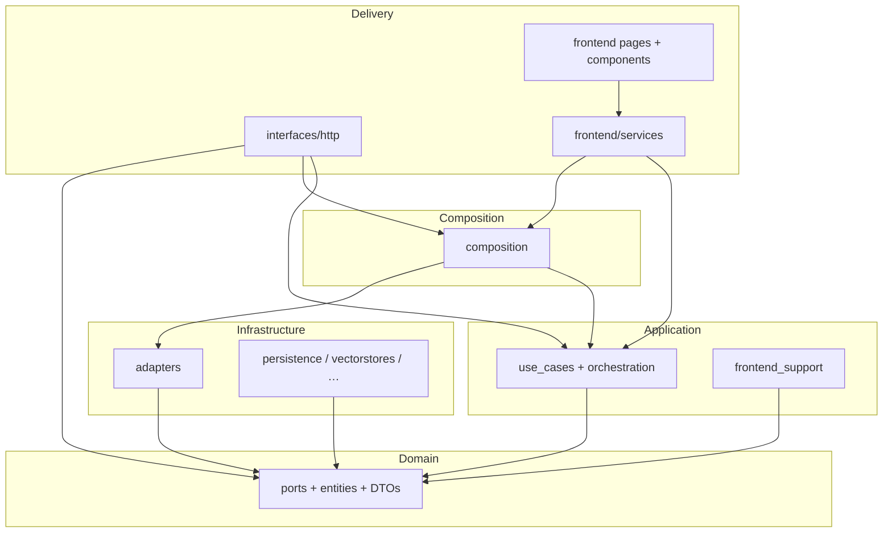

# Architecture (Clean Architecture)

RAGCraft follows a **ports-and-adapters** style: **domain** at the center, **application** orchestrates, **infrastructure** implements technical details, **composition** wires objects, **delivery** (FastAPI, Streamlit client) stays thin.

**Canonical flow details for RAG:** **`docs/rag_orchestration.md`**. **Import rules:** **`docs/dependency_rules.md`**. **End-state migration summary:** **`docs/migration_report_final.md`**.

## Canonical repository layout (enforced by tests)

- **Backend:** `api/src/` — packages `domain`, `application`, `infrastructure`, `composition`, `interfaces` (FastAPI lives under `interfaces/http/`). **`PYTHONPATH`** includes `api/src` so imports are `from domain...`, not `from src.domain...`.
- **Frontend:** `frontend/src/` — Streamlit pages, components, and `services` (HTTP / in-process gateway). **`PYTHONPATH`** includes `frontend/src` so pages use `from services...`.
- **Guardrails:** `api/tests/architecture/` fails CI on structural drift (forbidden roots, misplaced routers/schemas) and on import-boundary violations. Run `./scripts/validate_architecture.sh` from the repo root (or `pytest api/tests/architecture -q` with the same `PYTHONPATH` as in that script). See **`docs/testing_strategy.md`** for the module map.

## Domain (`api/src/domain/`)

**Belongs here:** entities, value objects, pure domain logic, **ports** (`Protocol` / ABC), **`AuthenticatedPrincipal`** (workspace identity from verified bearer auth), **`AuthenticationPort`** / **`AccessTokenIssuerPort`** (`api/src/domain/ports/`), and shared types such as `PipelineBuildResult` (**`latency`** is **`PipelineLatency`**, not a stage ``dict``), **`RAGResponse`** (**`latency`** is **`PipelineLatency | None`**), **`PipelineLatency`**, **`GoldQaPipelineRowInput`**, `SummaryRecallDocument`, `RetrievalSettings`, **`BufferedDocumentUpload`** (multipart ingest payload: filename + bytes), **`ProposedQaDatasetRow`** (LLM QA proposals before persistence), **`RagInspectAnswerRun`**, **`QueryLogIngressPayload`**, **`EvaluationJudgeMetricsRow`**, **`merge_summary_documents_weighted_rrf`** (`summary_document_fusion.py`), and retrieval policy helpers under **`api/src/domain/retrieval/`** (e.g. **`summary_recall_execution_plan`**).

**Does not belong:** FastAPI, Streamlit, SQLite drivers, LangChain, calls into `application` or `infrastructure` (except the narrow **`infrastructure.config`** allowance in tests). Domain may use **`core`** for config paths and shared exceptions where already established.

## Application (`api/src/application/`)

**Belongs here:**

- **Use cases** under `api/src/application/use_cases/` — one primary workflow per class (e.g. `AskQuestionUseCase`, `BuildRagPipelineUseCase`, `RunManualEvaluationUseCase`). Shared RAG orchestration **DTOs** live under **`api/src/application/rag/`** (imported by chat/eval paths; guarded by **`test_orchestration_package_import_boundaries`**).
- **RAG orchestration helpers** under `api/src/application/use_cases/chat/orchestration/` — e.g. **`summary_recall_workflow.py`** (**`ApplicationSummaryRecallStage`** implements **`SummaryRecallStagePort`**), **`summary_recall_ports.py`** (technical ports for rewrite / vector / lexical recall), **`recall_then_assemble_pipeline`**, **`summary_recall_from_request`**, **`assemble_pipeline_from_recall`**, **`post_recall_pipeline_steps`**, **`ApplicationPipelineAssembly`**, **`PipelineQueryLogEmitter`**, port definitions (**`ports.py`**, **`PostRecallStagePorts`**, **`PipelineBuildQueryLogEmitterPort`**).
- **Evaluation RAG helper** — `execute_rag_inspect_then_answer_for_evaluation` in **`use_cases/evaluation/rag_pipeline_orchestration.py`** (inspect + answer + latency for eval; no production query log). **`RunManualEvaluationUseCase`** is the **only** application entry point for one-off manual evaluation; infrastructure **`manual_evaluation_service`** supplies assembly from benchmark rows, not a second orchestrator.
- **`GoldQaBenchmarkAdapter`** — **`use_cases/evaluation/gold_qa_benchmark_adapter.py`**; implements **`GoldQaBenchmarkPort`** by delegating to **`BenchmarkExecutionUseCase`** (wired from composition, not from **`EvaluationService`** internals).
- **Pipeline use-case ports** — `use_cases/chat/pipeline_use_case_ports.py` (`InspectRagPipelinePort`, `GenerateAnswerFromPipelinePort`) so evaluation does not depend on concrete chat use case classes.
- **Policies** under `api/src/application/chat/policies/` — pure helpers (dedupe, wire shapes) used by orchestration; RRF merge lives in **domain** (`summary_document_fusion`).
- **DTOs / wire helpers** — `application/http/wire.py`, evaluation DTOs, settings DTOs; **`build_query_log_ingress_payload`** builds domain **`QueryLogIngressPayload`**. RAG orchestration DTOs under **`api/src/application/rag/dtos/`** (e.g. **`VectorLexicalRecallBundle`**, **`RagEvaluationPipelineInput`**) plus domain **`RetrievalSettingsOverrideSpec`** for typed retrieval overrides on chat/RAG ports.
- **`frontend_support/`** — HTTP-mode stubs for the gateway (`http_backend_stubs.py`, `memory_chat_transcript.py`) so **`frontend/src/services`** does not pull infrastructure adapters for HTTP mode.

**Does not belong:** importing concrete **`infrastructure`** adapters (wiring uses composition). Use cases must not import the frontend **`services`** package.

## Infrastructure (`api/src/infrastructure/`)

**Belongs here:**

- **`adapters/`** — concrete implementations: RAG stack (`docstore_service`, **`summary_recall_technical_adapters.py`** — thin **`QueryRewriteAdapter`**, **`SummaryVectorRecallAdapter`**, **`SummaryLexicalRecallAdapter`**), `post_recall_stage_adapters`, evaluation (**`EvaluationService`** consumes **`GoldQaBenchmarkPort`** only; no **`BenchmarkExecutionUseCase`** import), workspace, SQLite repositories, query logging, vector store helpers, ingestion loaders, etc. In-memory HTTP transcript lives in **`api/src/application/frontend_support/memory_chat_transcript.py`**, not under adapters.
- **`persistence/`**, **`vectorstores/`**, **`caching/`**, **`logging/`** — technical subsystems.

**Rules:**

- **Summary-recall sequencing** is **application-owned** (**`ApplicationSummaryRecallStage`**); infrastructure provides single-purpose technical steps behind **`SummaryRecallTechnicalPorts`**.
- Post–summary-recall **sequencing** for assembly lives in **application** (`assemble_pipeline_from_recall` + `post_recall_pipeline_steps`); adapters behind **`PostRecallStagePorts`** perform single technical steps.
- **All** of `api/src/infrastructure/adapters/**/*.py` must **not** import `application` (**`api/tests/architecture/test_adapter_application_imports.py`**). **`RetrievalSettingsTuner`** is constructed in **`backend_composition`** and passed into RAG wiring.
- **Query logging** is **not** implemented inside vectorstore/docstore/rerank modules; **`QueryLogService`** accepts dict or domain **`QueryLogIngressPayload`**.
- Non-adapter infrastructure must not depend on application (see layer tests).

## Composition (`api/src/composition/`)

**Belongs here:** building the object graph only.

| Module | Role |
|--------|------|
| `backend_composition.py` | `BackendComposition` — technical services only. Uses **`build_evaluation_service()`** from **`evaluation_wiring.py`** for the evaluation stack. |
| `evaluation_wiring.py` | Builds **`RowEvaluationService`**, **`BenchmarkExecutionUseCase`**, **`GoldQaBenchmarkAdapter`**, **`EvaluationService`**. |
| `application_container.py` | `BackendApplicationContainer` — memoized use cases, delegates to `chat_rag_wiring` for the RAG bundle. |
| `chat_rag_wiring.py` | Builds `RagRetrievalSubgraph` and `ChatRagUseCases`; wires **`InspectRagPipelineUseCase`** with the same **`BuildRagPipelineUseCase`** instance as **`RetrievalPort`**, which calls **`execute(..., emit_query_log=False)`** (no `partial` indirection). |
| `wiring.py` | Process-scoped chain cache invalidation hook for FastAPI. |

**Does not belong:** business flow sequencing (beyond one administrative `execute` for chain invalidation), Streamlit imports.

**Streamlit transcript:** `frontend/src/services/streamlit_backend_factory.build_streamlit_backend_application_container()` passes `backend=build_backend_composition(chat_transcript=StreamlitChatTranscript())` so session transcript wiring stays in the frontend gateway layer.

## HTTP delivery (`api/src/interfaces/http/`)

**Belongs here:** FastAPI app (mounted from **`api/main.py`**), routers, Pydantic schemas, `dependencies.py` resolving `BackendApplicationContainer` and use cases via `Depends`. Multipart uploads (**documents** and **avatars**) use **`interfaces.http.upload_adapter`** — chunked reads with per-route byte caps → domain **`BufferedDocumentUpload`** → use cases (**`IngestUploadedFileCommand`**, **`UploadUserAvatarCommand`**). Strategy is documented in **`api/src/application/ingestion/upload_boundary.py`** (bounded buffering, not socket-to-parser streaming).

**Identity:** Routes that require a logged-in workspace user depend on **`get_authenticated_principal`**, which parses **`Authorization: Bearer`** in **`dependencies.py`**, delegates verification to **`AuthenticationPort`** (implemented by **`JwtAuthenticationAdapter`** in infrastructure), and returns a framework-agnostic **`AuthenticatedPrincipal`**. Handlers pass **`principal.user_id`** into use cases only; they never interpret raw tokens.

**Auth and profile:** **`/auth/login`** and **`/auth/register`** call **`LoginUserUseCase`** / **`RegisterUserUseCase`** and issue a signed JWT via **`AccessTokenIssuerPort`** (same adapter). **`/users/*`** routes call dedicated user/account use cases. Password hashing and avatar filesystem I/O sit behind **`PasswordHasherPort`** and **`AvatarStoragePort`**, implemented by **`BcryptPasswordHasher`** and **`FileAvatarStorage`** (under **`api/src/infrastructure/adapters/auth/`** and **`…/filesystem/`**) and wired in **`build_backend_composition`**. JWT signing uses **`RAGCRAFT_JWT_SECRET`** (and optional **`RAGCRAFT_JWT_ISSUER`** / **`RAGCRAFT_JWT_AUDIENCE`**) — never hardcoded in source.

**Rule:** Routers must not import **`infrastructure.*`**; other HTTP modules follow **`test_fastapi_delivery_boundaries`**. Use cases resolve via **`Depends`** → **`BackendApplicationContainer`**. **`MemoryChatTranscript`** for the HTTP worker comes from **`application.frontend_support.memory_chat_transcript`**.

## Frontend gateway (`frontend/src/services/`)

**Belongs here:** `BackendClient` protocol, `HttpBackendClient`, `InProcessBackendClient`, HTTP transport/payloads, Streamlit auth glue, `StreamlitChatTranscript` (session-backed transcript), `streamlit_backend_factory`, factories under **`factories/`** (e.g. chat service wiring for Streamlit).

**Rule:** No imports of **`infrastructure`** except **`infrastructure.config`** and **`infrastructure.auth`** (see **`test_frontend_services_infrastructure_imports_are_limited`**). HTTP placeholders come from `application.frontend_support`. Gold-QA **`pipeline_runner`** must return **`RagInspectAnswerRun`** (**`BenchmarkExecutionUseCase`** raises **`TypeError`** otherwise).

## Other backend roots (`api/src/`)

- **`auth/`** — password utilities and helpers used with infrastructure auth; credential rules for HTTP live in application use cases.
- **`core/`** — config, paths, shared errors.

## Streamlit UI (`frontend/app.py`, `frontend/src/pages/`, `frontend/src/components/`)

Streamlit entry and pages; must use **`BackendClient`** via **`services`**, not `domain` / `application` / `composition` / `interfaces` directly from pages and components (enforced by tests).

**Dependency direction (target):** delivery → application use cases → domain ports ← infrastructure adapters. Composition instantiates and injects.

## Layer dependency diagram (runtime)

**Edges omitted for brevity:** **`api/src/auth`** and **`api/src/core`** are shared helpers; **`COMP`** also imports application types and domain ports when constructing the graph.

## Tooling (lint, format, typing)

Configuration lives in **`pyproject.toml`** at the repo root (dependencies for runtime remain in **`requirements.txt`**).

| Tool | Role |
|------|------|
| **Ruff** | Lint + import sort (`I`) + safe pyupgrade (`UP`); catches undefined names (`F821`) and unused imports (`F401`). Example: `ruff check api/src frontend/src` / `ruff format api/src frontend/src`. |
| **Black** | Formatter; line length **100** (match Ruff). |
| **mypy** | Incremental static typing; **`ignore_missing_imports`** by default for third-party gaps. Prefer tightening **ports, DTOs, and use-case signatures** over repo-wide strict mode in one step. Example: `mypy --config-file=pyproject.toml -p application.use_cases.chat.ask_question`. |

**CI (enforced):** **`.github/workflows/ci.yml`** runs **`scripts/lint.sh`**, **`scripts/validate_architecture.sh`**, and pytest (see **`scripts/validate.sh`** / **`validate.ps1`** for the same locally).
