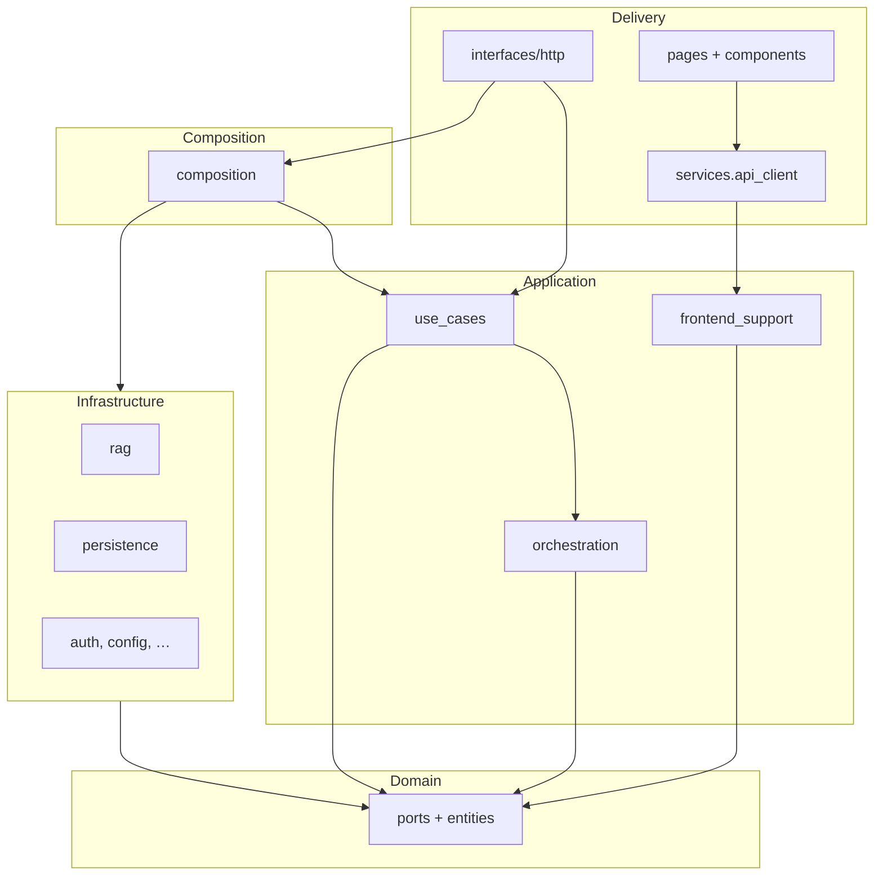

# Architecture

RAGCraft follows **Clean Architecture**: **domain** at the center, **application** owns workflows and orchestration, **infrastructure** implements ports, **composition** builds the runtime graph, and **delivery** (FastAPI under **`interfaces/http`**, Streamlit under **`frontend/src`**) stays thin.

**Related:** **`docs/rag_orchestration.md`** (RAG modes and pipelines), **`docs/dependency_rules.md`** (import rules), **`docs/api.md`** (HTTP and Streamlit client contract), **`docs/testing_strategy.md`** (test matrix), **`docs/product_features.md`** (features ↔ routes), **`docs/migration_report_final.md`** (closure). **Short layout:** **`ARCHITECTURE_TARGET.md`**.

---

## 1. Repository layout

| Area | Path | Role |
|------|------|------|
| Backend | **`api/src/`** | Packages: **`domain`**, **`application`**, **`infrastructure`**, **`composition`**, **`interfaces`** |
| ASGI entry | **`api/main.py`** | Sets **`sys.path`**, exposes **`app`** from **`interfaces.http.main:create_app`** for Uvicorn |
| Frontend | **`frontend/src/`** | **`pages`**, **`components`**, **`services`**, **`state`**, **`viewmodels`**, **`utils`** |
| Streamlit shell | **`frontend/app.py`** | Multi-page entry |
| Tests (API) | **`api/tests/`** | **`architecture`**, **`bootstrap`**, **`reliability`**, **`api`**, **`appli`**, **`infra`**, **`e2e`**, … |
| Tests (UI) | **`frontend/tests/`** | Streamlit, wire contracts, **`test_api_client.py`** |

**Imports:** With **`PYTHONPATH`** including **`api/src`** and **`frontend/src`** (see **`scripts/run_tests.sh`**), names are top-level: **`from domain…`**, **`from application…`**, **`from services…`**.

**Guardrails:** **`api/tests/architecture/`** and **`scripts/validate_architecture.sh`**.

---

## 2. Dependency direction

```text
Delivery (interfaces/http, Streamlit pages/components → services.api_client)
        → application (use cases + orchestration)
        → domain (entities, ports)
        ↑
        infrastructure (implements ports; no application imports, except documented narrow cases)
```

- **Composition** imports **domain**, **application**, **infrastructure** to build the graph. It **must not** import **`services`** (frontend) or Streamlit.
- **Domain** — no application, infrastructure, FastAPI, or Streamlit (except documented **`infrastructure.config`** allowances in tests).
- **Application** — domain + sibling **`application`**; no concrete infra or FastAPI in orchestration (see architecture tests).
- **Infrastructure** — implements ports; does not import **`application`** (except documented exceptions, e.g. auth credentials).
- **`interfaces/http`** — FastAPI, **`Depends`**, container, **domain** types in handlers; routers **do not** import **`infrastructure.*`**.
- **`frontend/src/pages`** and **`components`** — allowed **`services.*`** imports only (**`api_client`**, **`ui_errors`**, **`streamlit_context`**, **`settings_dtos`**, **`streamlit_auth`**) plus **`infrastructure.auth`** for guards; **no** direct **`domain`**, **`application`**, **`composition`**, or **`interfaces`** (see **`test_frontend_streamlit_services_entrypoint.py`**).
- **`services/api_client.py`** — sole bridge from the frontend tree into **`application.frontend_support`** (protocol, HTTP and in-process clients, wire mappers, Streamlit factory glue).

---

## 3. Domain (`api/src/domain/`)

Entities, value objects, **ports** (**`RetrievalPort`**, **`AnswerGenerationPort`**, **`QueryLogPort`**, …), identity (**`AuthenticatedPrincipal`**, auth ports), RAG payloads (**`PipelineLatency`**, **`BufferedDocumentUpload`**, **`RetrievalSettingsOverrideSpec`**, …). **No** frameworks or adapters here.

---

## 4. Application (`api/src/application/`)

| Area | Path | Role |
|------|------|------|
| Use cases | **`application/use_cases/`** | Chat, evaluation, ingestion, projects, auth, settings, … |
| Orchestration | **`application/orchestration/rag/`**, **`orchestration/evaluation/`** | Recall → assembly, evaluation pipelines, benchmarks |
| DTOs / wire | **`application/dto/`**, **`application/http/wire/`** | Typed commands/results; JSON at transport edge |
| RAG DTOs | **`application/rag/dtos/`** | Recall bundles, evaluation inputs |
| Streamlit ↔ backend glue | **`application/frontend_support/`** | **`BackendClient`** protocol, **`HttpBackendClient`**, **`InProcessBackendClient`**, **`client_wire_mappers`**, **`view_models`**, **`streamlit_backend_factory`**, **`streamlit_backend_access`** |
| API worker transcript | **`application/services/memory_chat_transcript.py`** | In-memory **`ChatTranscriptPort`** for HTTP (not Streamlit) |

**Rule:** Post-recall **ordering** lives in **application**; **infrastructure/rag** exposes single-purpose steps behind ports.

**RAG modes:** ask vs inspect vs preview vs evaluation — see **`docs/rag_orchestration.md`** and **`api/tests/appli/orchestration/test_rag_mode_contracts.py`**.

---

## 5. Infrastructure (`api/src/infrastructure/`)

**`rag/`**, **`evaluation/`**, **`persistence/`**, **`auth/`**, **`storage/`**, **`observability/`**, **`config/`**. **No** use-case orchestration sequences. Query logs are built from application/domain contracts, not inside vector internals.

---

## 6. Composition (`api/src/composition/`)

**`build_backend_composition`**, **`BackendApplicationContainer`**, **`chat_rag_wiring`**, **`evaluation_wiring`**, lifecycle in **`wiring.py`**. Streamlit’s session transcript is wired via **`application.frontend_support.streamlit_backend_factory`** (**`StreamlitChatTranscript`** passed into **`build_backend_composition`**).

---

## 7. HTTP delivery (`api/src/interfaces/http/`)

**`create_app`**, routers, Pydantic schemas, **`dependencies.py`**, **`upload_adapter`**, error handlers. Scoped routes: **`Authorization: Bearer`**, **`AuthenticatedPrincipal`**, **`user_id`** into use cases only.

---

## 8. Frontend integration (`frontend/src/`)

- **`services/api_client.py`** — **only** module **pages** and **components** use for backend façade types and **`get_backend_client`**.
- **`services/`** wire helpers — **`api_contract_models`**, **`evaluation_wire_*`**, **`http_payloads`**, **`http_transport`**, auth/session modules; implementation of HTTP/in-process **clients** lives under **`api/src/application/frontend_support/`**, re-exported through **`api_client`**.

---

## 9. Testing and tooling

**Matrix:** **`docs/testing_strategy.md`**. **Gate:** **`scripts/validate_architecture.*`** (architecture + bootstrap), then **`scripts/run_tests.*`**.

| Tool | Config | Use |
|------|--------|-----|
| Ruff | **`pyproject.toml`** | `ruff check api/src frontend/src` (+ architecture tests in CI) |
| pytest | Root + **`api/pyproject.toml`** | Layered suites; marker **`reliability`** for **`api/tests/reliability/`** |

---

## 10. Layer diagram (runtime)



---

## 11. Baseline (closure)

Under **`api/src/`** only the **five** packages above plus **`api/main.py`**. **Deferred / rating:** **`docs/migration_report_final.md`** §10 and §18.
