# Architecture

RAGCraft uses **Clean Architecture** (ports and adapters): **domain** at the center, **application** owns workflows and orchestration, **infrastructure** implements technical details, **composition** builds the object graph, and **delivery** (FastAPI and the Streamlit client) stays thin.

**Related:** **`docs/rag_orchestration.md`** (RAG flows and ownership), **`docs/dependency_rules.md`** (import rules and enforcement), **`docs/api.md`** (HTTP contract), **`docs/product_features.md`** (supported features vs routes, tests, UI), **`docs/migration_report_final.md`** (closure and guardrails).

---

## Repository layout

| Area | Path | Role |
|------|------|------|
| Backend packages | **`api/src/`** | `domain`, `application`, `infrastructure`, `composition`, `interfaces` |
| ASGI entry | **`api/main.py`** | Loads `api/src` onto `sys.path` and exposes **`interfaces.http.main:create_app`** as **`app`** for Uvicorn |
| Frontend packages | **`frontend/src/`** | `pages`, `components`, `services`, `state`, `viewmodels`, `utils` |
| Streamlit entry | **`frontend/app.py`** | Multi-page app shell |
| Backend tests | **`api/tests/`** | Architecture guards under **`api/tests/architecture/`**, plus `api`, `appli`, `infra`, `e2e`, … |
| Frontend tests | **`frontend/tests/`** | UI and **`frontend/src/services`** tests (e.g. **`frontend/tests/streamlit/`**) |

**Imports:** With **`PYTHONPATH`** including **`api/src`** and **`frontend/src`** (as in **`scripts/run_tests.sh`** / **`scripts/validate_architecture.sh`**), Python import names are **top-level** (`from domain...`, `from application...`, `from services...`), not nested under a shared `src` package.

**Enforcement:** **`api/tests/architecture/`** fails on forbidden repo roots, misplaced FastAPI routers/schemas, code living outside **`api/src`** / **`frontend/src`**, and disallowed cross-layer imports. Run **`./scripts/validate_architecture.sh`** from the repo root.

---

## Dependency direction (allowed)

```text
Delivery (interfaces/http, frontend/services, Streamlit UI)
        → application (use cases + orchestration)
        → domain (entities, value objects, ports)
        ↑
        └── infrastructure (implements domain ports; no application imports)
```

**Composition** may import **domain**, **application** (for wiring), and **infrastructure** to construct the graph. It must not import **Streamlit** or **`frontend/src/services`**.

**Summary:**

- **Domain** does not depend on application, infrastructure, FastAPI, or Streamlit (narrow **`infrastructure.config`** exception where tests allow).
- **Application** depends on **domain** and sibling **`application`** modules; it does not import concrete infrastructure or delivery frameworks (narrow **`infrastructure.config`** exception).
- **Infrastructure** implements ports; it does not import **`application`** (see **`test_adapter_application_imports.py`** for the **`auth_credentials`** exception).
- **`interfaces/http`** uses FastAPI, **`Depends`**, **`BackendApplicationContainer`**, and **domain** types; **routers** must not import **`infrastructure.*`**.
- **`frontend/src/services`** may call use cases and composition for **in-process** mode and may use **`infrastructure.config`** / **`infrastructure.auth`** only (not full RAG/persistence stacks).
- **`frontend/src/pages`** and **`components`** use **`services`** and **`infrastructure.auth`** for guards only—not **`domain`**, **`application`**, **`composition`**, or **`interfaces`**.

---

## Domain (`api/src/domain/`)

**Owns:** entities and value objects, **ports** (`Protocol` / ABC) such as **`RetrievalPort`**, **`AnswerGenerationPort`**, **`QueryLogPort`**, identity types (**`AuthenticatedPrincipal`** under **`domain/auth/`**), auth ports (**`AuthenticationPort`**, **`AccessTokenIssuerPort`** under **`domain/common/ports/`** and related modules), and shared DTOs (**`RagInspectAnswerRun`**, **`QueryLogIngressPayload`**, **`PipelineLatency`**, **`BufferedDocumentUpload`**, **`RetrievalSettingsOverrideSpec`** under **`domain/rag/`**, etc.).

**Does not own:** framework or adapter code (FastAPI, Streamlit, SQLite drivers, LangChain in domain modules).

---

## Application (`api/src/application/`)

**Owns:**

- **Use cases** — **`application/use_cases/**`** (e.g. chat, evaluation, ingestion, projects, auth).
- **RAG orchestration** — **`application/orchestration/rag/`** (summary recall workflow, post-recall assembly, pipeline steps) and **`application/orchestration/evaluation/`** (e.g. **`rag_pipeline_orchestration.py`**, **`gold_qa_benchmark_adapter.py`**, benchmark execution helpers).
- **RAG DTOs** — **`application/rag/dtos/`** (recall bundles, evaluation pipeline input, etc.).
- **Policies and chat helpers** — **`application/chat/`** (e.g. **`multimodal_prompt_hints`**).
- **DTOs and HTTP wire helpers** — **`application/dto/**`** (including retrieval comparison results in **`application/dto/retrieval_comparison.py`**) and **`application/http/wire/`** (map typed application/domain objects to JSON-serializable dicts in **`as_json_dict()`**, not ad hoc dicts through the use-case core).
- **Frontend-facing stubs for HTTP mode** — **`application/frontend_support/`** (**`MemoryChatTranscript`**, etc.) so the FastAPI worker does not depend on infrastructure adapters for transcript behavior.

**Does not own:** wiring the live graph (that is **composition**) or low-level I/O (that is **infrastructure**).

**Orchestration rule:** Summary-recall **ordering** and post-recall **pipeline ordering** live in **application**; infrastructure supplies single-purpose steps behind ports (e.g. **`SummaryRecallTechnicalPorts`**, **`PostRecallStagePorts`**).

**RAG modes:** **ask** (**`AskQuestionUseCase`**) vs **inspect** (**`InspectRagPipelineUseCase`**, no query log) vs **preview** (recall-only) vs **evaluation** (**`execute_rag_inspect_then_answer_for_evaluation`**) are separate use-case surfaces; see **`docs/rag_orchestration.md`** and **`api/tests/appli/orchestration/test_rag_mode_contracts.py`**.

**Runtime smoke:** **`api/tests/bootstrap/`** (invoked from **`scripts/validate_architecture.*`**) complements layout tests by loading **`create_app()`** and the **`api/main.py`** entry file; see **`docs/testing_strategy.md`** and **`docs/migration_report_final.md`** §13.

---

## Infrastructure (`api/src/infrastructure/`)

**Owns:** concrete implementations—**`rag/`** (retrieval, docstore, LLM gateway, **`summary_recall_technical_adapters`**, **`post_recall_stage_adapters`**, **`answer_generation_service`**), **`evaluation/`**, **`persistence/`**, **`auth/`**, **`storage/`**, **`observability/`**, **`config/`**.

**Does not own:** use-case orchestration sequences or importing **`application`** (except the documented narrow exception in **`auth_credentials`**).

**Query logging:** Built via domain **`QueryLogIngressPayload`** from application; not embedded inside vectorstore/rerank internals.

---

## Composition (`api/src/composition/`)

**Owns:** **`build_backend_composition`**, **`BackendApplicationContainer`**, **`chat_rag_wiring`**, **`evaluation_wiring`**, **`backend_composition`**, FastAPI lifecycle hooks in **`wiring.py`**.

**Does not own:** end-user UI or business scenario scripts (beyond wiring).

**Streamlit:** Session transcript is supplied from **`frontend/src/services/streamlit_backend_factory`** via **`StreamlitChatTranscript`** and **`build_backend_composition(chat_transcript=...)`**.

---

## HTTP delivery (`api/src/interfaces/http/`)

**Owns:** FastAPI **`create_app`**, **routers** under **`routers/`**, Pydantic **schemas** under **`schemas/`**, **`dependencies.py`** (cached **`BackendApplicationContainer`**, **`get_authenticated_principal`**), **`upload_adapter`** (bounded multipart reads), error handlers.

**Security model:** Scoped routes use **`Authorization: Bearer <JWT>`**. **`dependencies`** delegates verification to **`AuthenticationPort`**; handlers receive **`AuthenticatedPrincipal`** and pass **`user_id`** into use cases only.

**Rule:** Routers resolve work through **`Depends`** → container → use cases; they do not import **`infrastructure.*`**.

---

## Frontend integration (`frontend/src/`)

**`services/`** — **`BackendClient`** protocol (**`services/protocol.py`**), HTTP (**`http_client.py`**) and in-process (**`in_process.py`**) clients, **`api_client.py`** as the **documented canonical import surface** for the backend façade, **`http_payloads.py`** / **`api_contract_models.py`** / **`evaluation_wire_*`** as the **frontend-owned wire contract** matching FastAPI JSON, **`client_wire_mappers.py`** to align in-process return types with that wire contract, Streamlit auth/session helpers, **`streamlit_backend_factory`**. This is the only place that may combine **composition + use cases** for the Streamlit app.

**HTTP client rule:** **`http_client.py`** must not import **`domain`** or **`application.dto`** for response parsing; **`TYPE_CHECKING`** may reference domain types only for signatures of **NotImplemented** in-process-only methods.

**`pages/`**, **`components/`** — Streamlit UI; consume **`services`** only (plus **`infrastructure.auth`** for guards where allowed).

**`state/`**, **`viewmodels/`**, **`utils/`** — UI state and helpers; same import rules as pages/components unless tests say otherwise.

---

## Testing (enforcement and confidence)

**`docs/testing_strategy.md`** is the full matrix: architecture + bootstrap gate, **`api/tests/api`** contracts, **`appli`** use cases and **`appli/orchestration/test_rag_mode_contracts`**, infra/composition/e2e, and **`frontend/tests`**. Pytest **markers** (registered in **`api/tests/conftest.py`**) label tests by folder for optional filtered runs. Together these justify **high confidence** in layout, dependency direction, HTTP error envelopes, and RAG **mode separation** — not every production scenario.

---

## Layer diagram (runtime)

```mermaid
flowchart TB
  subgraph delivery["Delivery"]
    HTTP["interfaces/http"]
    SVC["frontend/src/services"]
    UI["frontend/src/pages + components"]
  end
  subgraph comp["Composition"]
    COMP["composition"]
  end
  subgraph app["Application"]
    UC["use_cases"]
    ORCH["orchestration/rag + orchestration/evaluation"]
    FS["frontend_support"]
  end
  subgraph dom["Domain"]
    PORTS["ports + entities + DTOs"]
  end
  subgraph infra["Infrastructure"]
    RAG["rag"]
    EVAL["evaluation"]
    PERS["persistence"]
    OTHER["auth, storage, observability, config"]
  end
  HTTP --> UC
  HTTP --> COMP
  HTTP --> PORTS
  SVC --> UC
  SVC --> COMP
  UI --> SVC
  COMP --> UC
  COMP --> infra
  UC --> ORCH
  ORCH --> PORTS
  UC --> PORTS
  infra --> PORTS
  FS --> PORTS
```



---

## Tooling

| Tool | Config | Typical use |
|------|--------|-------------|
| **Ruff** | Root **`pyproject.toml`** | `ruff check api/src frontend/src` (CI also checks **`api/tests/architecture`**) |
| **Black** | Root **`pyproject.toml`** | Formatting, line length 100 |
| **pytest** | Root + **`api/pyproject.toml`** | Architecture gate: **`api/tests/architecture`** |
| **mypy** | Root **`pyproject.toml`** | Optional incremental; e.g. **`PYTHONPATH=api/src`** then **`-p domain`** |

CI runs **`scripts/lint.sh`**, **`scripts/validate_architecture.sh`**, and the non-architecture pytest slice—see **`.github/workflows/ci.yml`**.
